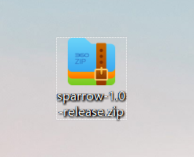
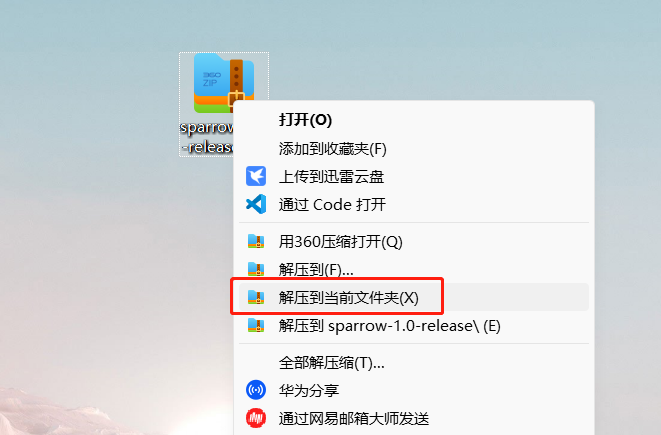
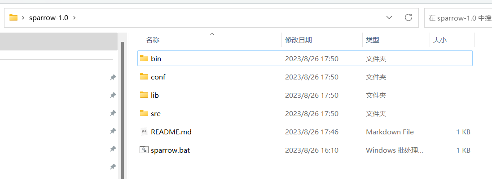
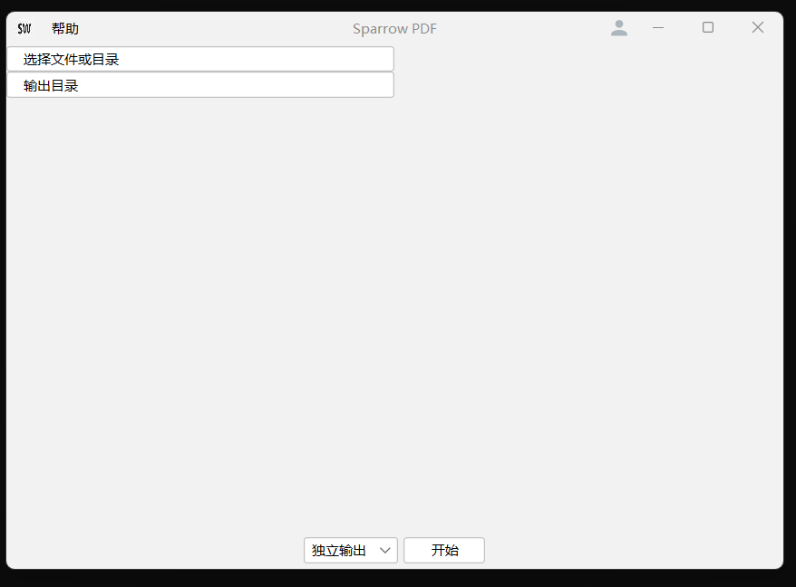
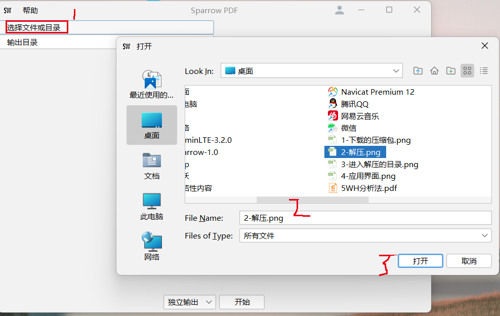
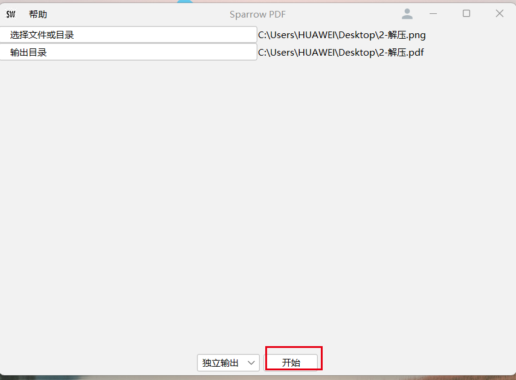

# 开始使用
图片转PDF工具

解压sparrow-${version}-release.zip后，进入解压目录，然后双击sparrow.bat文件，注意此时会出现CMD黑窗口，不要点击右上角的X， 不予理会即可（或者点击 - 号进行窗口最小化） ，否则应用会自动关闭，使用完毕，可以点击应用右上角的X，程序会自动退出。
  

***
1.&nbsp;获取资源包  
  
2.&nbsp;解压  
  
3.&nbsp;进入解压后的文件夹

4.&nbsp;运行应用  
双击文件夹内的sparrow.bat后稍等出现以下界面

5.&nbsp;转换文件格式  

